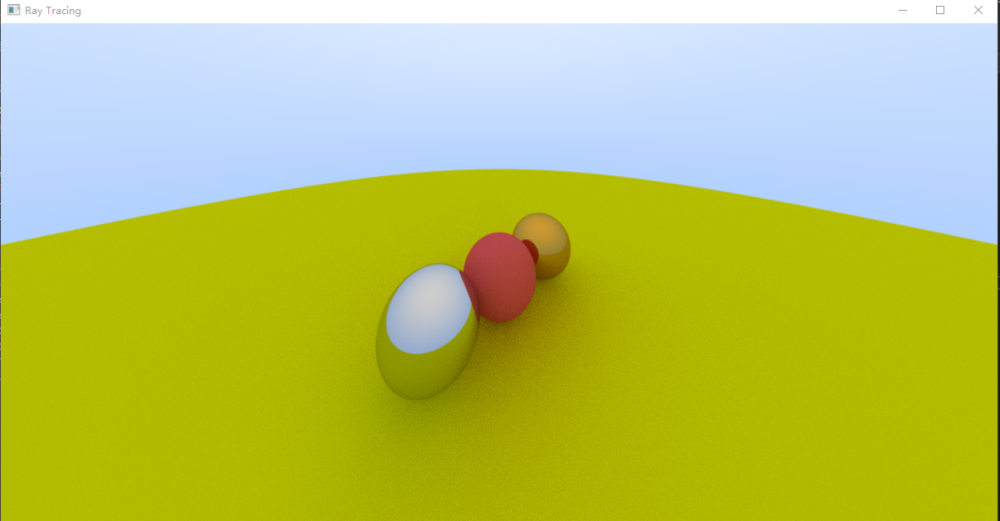
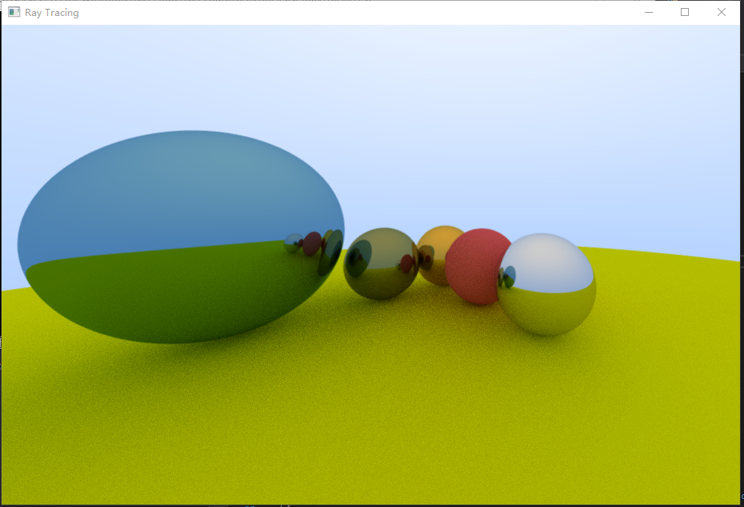

# RayTracer

Ray tracing implemented using C++ && OpenGL.

## Current Progress

- [x] Multi-threading ray tracer
- [ ] GPU version based on compute shader
- [ ] Monte Carlo sampling
- [ ] Fresnel reflection
- [ ] Subsurface scattering
- [ ] BRDFs
